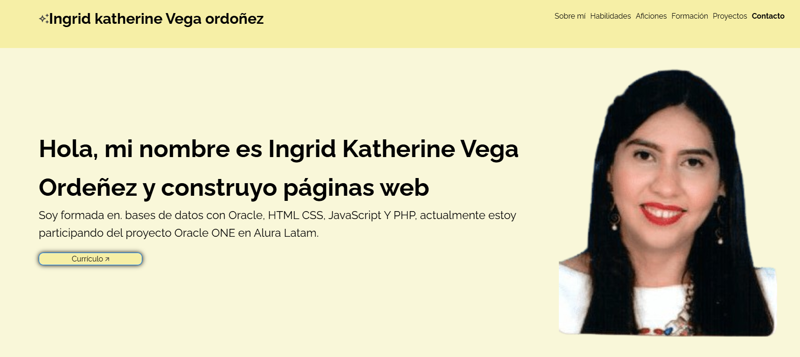
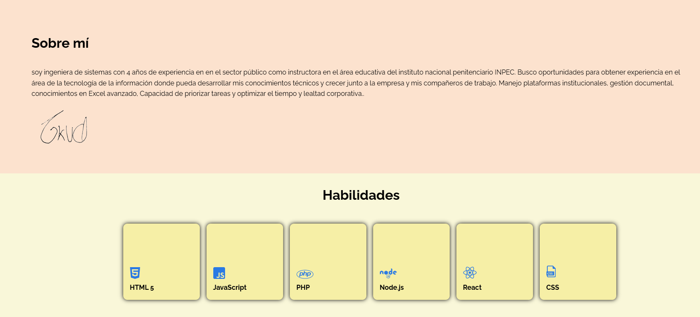
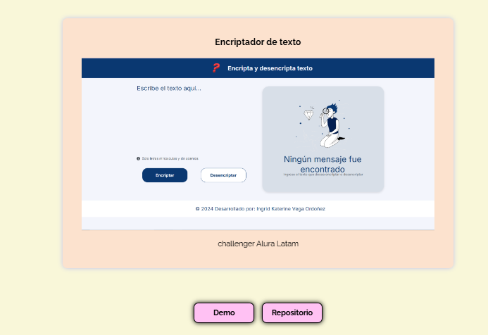

# Portafolio

¡Bienvenido al proyecto base del Portafolio ! Pasos principales:
Marca este proyecto con una estrella ⭐
Sigue las lecciones y las instrucciones de contenido 📚
Analisando el repositorio!
Este repositorio contiene el portafolio con una breve presentación de la programandora, sus habilidades, aficiones y experencia profesional con muestra de sus proyectos con su demo y link del repositorio.

## Demo

[Demo portafolio](https://ingridk12.github.io/potafolio/)
## Screenshots

## Features

El portafolio está compuesto por:
**Menú superior** contiene los link a cada una de las secciones de la pagania 
**Sobre mi** Breve descripcion del desorrallador, junto con sus conocimientos tecnicos.También un boton que permitirá descargar el cv en formato pdf a quien visite la pagina.
**Habilidades** Se encontrarán con unas tarjetas interactivas que mesionan los conocimientos tecnicos del desarrollador tales como javaScript, React etc.
**Aficiones** De la misma manera que Habilidades muestra los hobies o Aficiones del creador, como leer musica y otros.
**Formación acádpemica** Muestra los estudios profesionales, diplomados o cursos realizados.
**Experiencia profesionales** Presenta los diferentes protectos en los que a participado el desarrollador, dejando ver una imagen del proyecto, su nombre, un boton de demo con el link que nos lleva al la pagina y ver su funcionalidad y un boton con el link del repositorio.

## Tech Stack

**Frontend:** Html, Css, JavaScript

